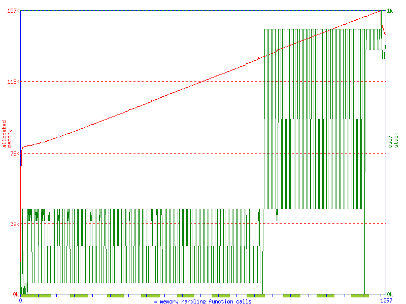

# C/C++ Data Structures

This project contains the data structures implemented through the "C/C++ Data Structures" course.

## How to build

The current project was configured using cmake, to build it the following script can be used:

```bash
mkdir build;
cd ./build/;
cmake ..;
make;
```

## How to run final project

After building, the final project can be run with the following commands while on build folder:

```bash

ctest -V -R  media_retrieval
# OR
./problems/media_retrieval/media_retrieval ./problems/media_retrieval/data/tv_packets.bin
# Run to generate memory usage graph 
memusage -p graph.png ./problems/media_retrieval/media_retrieval ./problems/media_retrieval/data/tv_packets.bin
```

## Results

After running the program above the final output can be seen:

```
XYZ1_1
c2
73
a6
DEF9_0
db
c8
d8
```

And by running it with _memusage_ tool we can observe memory allocation on the system:



on this graph the consumption of memory reached a peak of 157 KB, with the baseline consumption of 78 KB which leaves 79 KB as total memory used to hold and organize the file content.
